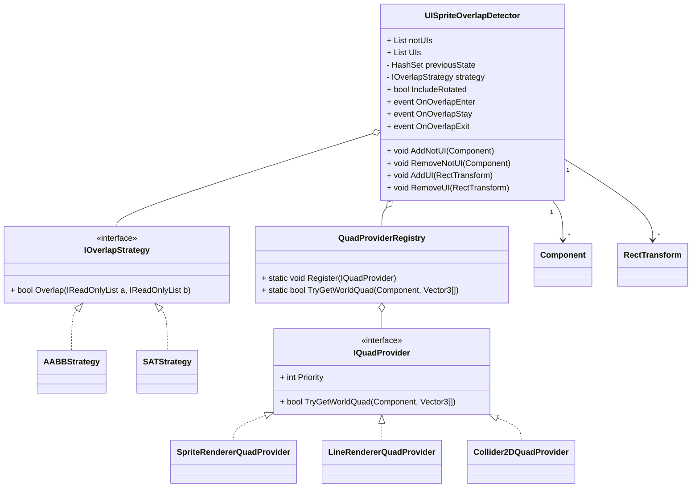

よろしければ、Star お願いします！

# UIOverlapDetector

- Unity2D 用のスクリプト群で、`RectTransform` を持つ UI と `SpriteRenderer` や `LineRenderer`、`Collider2D` などの非 UI の重なりを検出する
- 現在は 2D コンポーネントのみをサポートし、3D 対応は今後の予定
- 対象同士が重なった瞬間、重なっている間、離れた瞬間をそれぞれイベントとして受け取り、UI の半透明化や当たり判定の補助などに利用できる

## 使用例

- 操作キャラが UI と重なった際、UI を半透明にして操作キャラを見やすくしている
- Enter, Exit イベントで UI の透明度を操作している

## 機能
- 任意の `RectTransform` と `SpriteRenderer`、`LineRenderer`、`Collider2D` を登録して画面上での重なりを監視
- 対応外コンポーネントを登録しようとすると警告ログを出力
- 重なりの状態に応じて `OnOverlapEnter`、`OnOverlapStay`、`OnOverlapExit` を発火
- 判定アルゴリズムを `IOverlapStrategy` で差し替え可能
  - 軸整列矩形を用いる `AABBStrategy`
  - 傾きを考慮する `SATStrategy`
- 非 UI コンポーネントの矩形化は `IQuadProvider` で拡張可能
  - 標準で `SpriteRenderer`、`LineRenderer`、`Collider2D` 用を内蔵
- `IncludeRotated` オプションで自動的に判定方法を切り替え
- Gizmos による確認用のデバッグ描画

## 他の手段との比較

本ライブラリは「UI（RectTransform）と非UI（SpriteRenderer/LineRenderer/Collider2D）の重なりを検出し、イベントで扱える」点に特徴があります。既存手段と役割が異なるため、下表のように使い分けを推奨します。

> ここでは uGUI（Unity UI）を前提に記述しています。

| アプローチ | 目的に合う場面 | 強み | 弱み, ハマりどころ | 当ライブラリとの関係 |
|---|---|---|---|---|
| **GraphicRaycaster の BlockingObjects** | UI 同士のクリック貫通防止, 背面ブロック | 標準機能で簡単、入力まわりの統制に強い | 視覚的な重なりは解決しない(見た目そのまま)。非UIとの見た目の干渉は直接扱えない | **補完関係**。入力制御は Raycaster、視認性(見た目の重なり検出)は本ライブラリ |
| **CanvasGroup(alpha, blocksRaycasts)** | UI の**透明度や入力**をまとめて制御 | 実装が軽い。ポリシーを 1 箇所に集約できる | いつ切り替えるかの**トリガー**が別途必要 | **相性が良い**。本ライブラリの Enter, Stay, Exit をトリガーに CanvasGroup を操作 |
| **SortingLayer, Order(Renderer, SortingGroup)** | 2D描画の前後関係を制御 | 表示順の制御に強い | **Screen Space - Overlay** の UI は常に最前面で、非UIより前に描かれるため、ソートでは解決できない | UI×非UIの**越境**には不向き。視認性の調整は本ライブラリ＋CanvasGroup で |
| **SpriteMask, RectMask2D, Mask** | 形状に基づく**切り抜き**や限定表示 | 表現力が高い | セットアップやデザイン調整のコストが高く、副作用が出やすい。UI と SpriteMask はレンダリング経路が別 | **目的が異なる**(切り抜き表現)。視認性確保だけならフェードの方が副作用が小さい |
| **Physics2D.Overlap**(自前実装) | 非UI同士や任意形状の当たり判定 | 柔軟、パフォーマンス調整も可能(NonAlloc 等) | UI の RectTransform を**正確に世界座標へ投影**し、差分更新, イベント化まで自作が必要 | 本ライブラリはこのブリッジやイベント化をまとめて提供 |
| **本ライブラリ** | **UI, 非UI の**重なりを**検出→イベント発行** | UI, 非UI を統一APIで扱える、AABB と SAT を切替、差分で Enter, Stay, Exit 通知 | UI 同士のみの前後制御や入力制御は標準で足りる場合あり | **併用推奨**：入力は Raycaster/CanvasGroup、見た目の重なり検知は本ライブラリ |

### 選定ガイドライン
- **UI同士のクリック抜け**が主題 → *GraphicRaycaster（BlockingObjects）/CanvasGroup.blocksRaycasts* でOK。  
- **UI（特に Overlay）と自機/弾/前景が重なると見にくい** → 本ライブラリの Enter/Exit を**トリガー**に *CanvasGroup.alpha* を自動制御（フェード/非表示/縮小など）。  
- **大量要素**を常時監視 → まず AABB 戦略で実装し、**回転を含む箇所だけ SAT** にフォールバック。必要に応じて更新差分・NonAlloc を組み合わせる。

### 比較の参考資料（公式ドキュメント）
- Unity, **Canvas（Render Modes / Overlay・Camera・World）**, https://docs.unity3d.com/Packages/com.unity.ugui@1.0/manual/UICanvas.html  
- Unity, **Enum GraphicRaycaster.BlockingObjects**, https://docs.unity3d.com/Packages/com.unity.ugui@1.0/api/UnityEngine.UI.GraphicRaycaster.BlockingObjects.html  
- Unity, **CanvasGroup – Scripting API**（alpha / blocksRaycasts）, https://docs.unity3d.com/ScriptReference/CanvasGroup.html  
- Unity, **RectTransform.GetWorldCorners – Scripting API**, https://docs.unity3d.com/ScriptReference/RectTransform.GetWorldCorners.html  
- Unity, **RectTransformUtility.WorldToScreenPoint – Scripting API**, https://docs.unity3d.com/6000.1/Documentation/ScriptReference/RectTransformUtility.WorldToScreenPoint.html  
- Unity, **Physics2D.OverlapArea / OverlapBox – Scripting API**, https://docs.unity3d.com/ScriptReference/Physics2D.OverlapArea.html / https://docs.unity3d.com/ScriptReference/Physics2D.OverlapBox.html  
- Unity, **Sprite Masks – Manual**, https://docs.unity3d.com/6000.1/Documentation/Manual/sprite/mask/mask-landing.html

## クラス図


## 導入方法
- UISpriteOverlapDetector.dll を Unity プロジェクトの `Assets/Plugins` に追加

## 使用例
```csharp
public class Sample : MonoBehaviour
{
    [SerializeField] private UISpriteOverlapDetector detector;
    [SerializeField] private Collider2D player;
    [SerializeField] private RectTransform ui;

    private void Start()
    {
        detector.AddNotUI(player);
        detector.AddUI(ui);

        detector.OnOverlapEnter += HandleEnter;
        detector.OnOverlapStay  += HandleStay;
        detector.OnOverlapExit  += HandleExit;
    }

    private void HandleEnter(Component c, RectTransform r)
    {
        Debug.Log($"Enter: {c.name} x {r.name}");
    }

    private void HandleStay(Component c, RectTransform r)
    {
        Debug.Log($"Stay: {c.name} x {r.name}");
    }

    private void HandleExit(Component c, RectTransform r)
    {
        Debug.Log($"Exit: {c.name} x {r.name}");
    }
}
```

## 拡張
- `IQuadProvider` を実装することで独自コンポーネントにも対応可能
```csharp
public sealed class CustomQuadProvider : IQuadProvider
{
    public int Priority => 50;

    public bool TryGetWorldQuad(Component c, Vector3[] worldCorners)
    {
        if (c is not MyComponent comp) return false;
        // worldCorners に四隅を格納
        return true;
    }
}

// アプリ起動時などに登録
QuadProviderRegistry.Register(new CustomQuadProvider());
```

## 必要環境
- Unity 2022.3.9f1 以上で動作確認

## 参考
- [Zenn - 【Unity2D】UIと非UIの当たり判定【GIFアリ,SpriteRenderer】](https://zenn.dev/gameshitai/articles/dbefb7f7551a12)  
  記事では実装の背景や工夫点、GIF付の利用例などを解説している

## ライセンス
- このリポジトリは MIT License の下で公開されている
- 詳細は `LICENSE` ファイル参照
