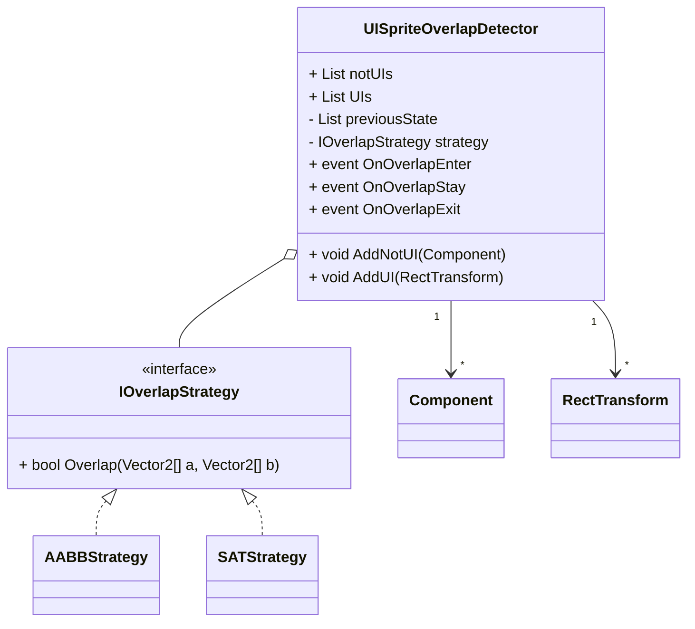

# UISpriteOverlapDetector

Unity 用のスクリプト群で、`RectTransform` を持つ UI と `SpriteRenderer` などの非 UI コンポーネントの重なりを検出します。対象同士が重なった瞬間・重なっている間・離れた瞬間をそれぞれイベントとして受け取れるため、UI の半透明化や当たり判定の補助などに利用できます。

## 機能
- 任意の `RectTransform` と `SpriteRenderer` を登録して画面上での重なりを監視
- 重なりの状態に応じて `OnOverlapEnter` / `OnOverlapStay` / `OnOverlapExit` を発火
- 判定アルゴリズムを `IOverlapStrategy` で差し替え可能
  - 軸整列矩形を用いる `AABBStrategy`
  - 傾きも考慮する `SATStrategy`
- `IncludeRotated` オプションで自動的に判定方法を切り替え
- Gizmos による確認用のデバッグ描画

## クラス図


## 使用例
```csharp
public class Sample : MonoBehaviour
{
    [SerializeField] private UISpriteOverlapDetector detector;
    [SerializeField] private SpriteRenderer player;
    [SerializeField] private RectTransform ui;

    private void Start()
    {
        detector.AddNotUI(player);
        detector.AddUI(ui);

        detector.OnOverlapEnter += HandleEnter;
        detector.OnOverlapStay  += HandleStay;
        detector.OnOverlapExit  += HandleExit;
    }

    private void HandleEnter(Component c, RectTransform r)
    {
        Debug.Log($"Enter: {c.name} x {r.name}");
    }

    private void HandleStay(Component c, RectTransform r)
    {
        Debug.Log($"Stay: {c.name} x {r.name}");
    }

    private void HandleExit(Component c, RectTransform r)
    {
        Debug.Log($"Exit: {c.name} x {r.name}");
    }
}
```

## 必要環境
- Unity 2022.3.9f1 以上で動作確認

## 参考
- [Zenn 記事 - UI と Sprite の重なり検出を汎用化する実装例](https://zenn.dev/)  
  記事では実装の背景や設計方針、アルゴリズムの選択理由などを解説しています。

## ライセンス
このリポジトリは MIT License の下で公開されています。詳細は `LICENSE` ファイルを参照してください。
