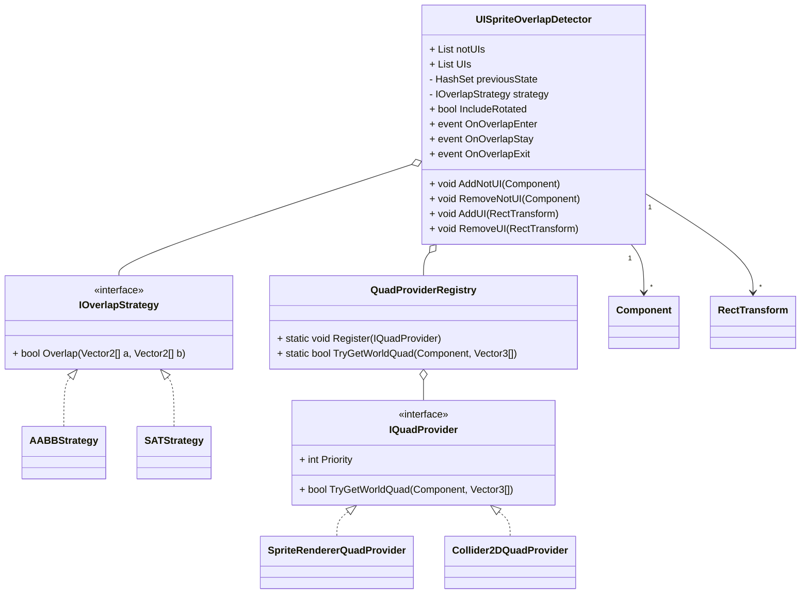

# UISpriteOverlapDetector

- Unity2D 用のスクリプト群で、`RectTransform` を持つ UI と `SpriteRenderer` や `Collider2D` などの非 UI の重なりを検出する
- 現在は 2D コンポーネントのみをサポートし、3D 対応は今後の予定
- 対象同士が重なった瞬間、重なっている間、離れた瞬間をそれぞれイベントとして受け取り、UI の半透明化や当たり判定の補助などに利用できる

## 機能
- 任意の `RectTransform` と `SpriteRenderer` または `Collider2D` を登録して画面上での重なりを監視
- 対応外コンポーネントを登録しようとすると警告ログを出力
- 重なりの状態に応じて `OnOverlapEnter`、`OnOverlapStay`、`OnOverlapExit` を発火
- 判定アルゴリズムを `IOverlapStrategy` で差し替え可能
  - 軸整列矩形を用いる `AABBStrategy`
  - 傾きを考慮する `SATStrategy`
- 非 UI コンポーネントの矩形化は `IQuadProvider` で拡張可能
  - 標準で `SpriteRenderer`、`Collider2D` 用を内蔵
- `IncludeRotated` オプションで自動的に判定方法を切り替え
- Gizmos による確認用のデバッグ描画

## クラス図


## 導入方法
- UISpriteOverlapDetector.dll を Unity プロジェクトの `Assets/Plugins` に追加

## 使用例
```csharp
public class Sample : MonoBehaviour
{
    [SerializeField] private UISpriteOverlapDetector detector;
    [SerializeField] private Collider2D player;
    [SerializeField] private RectTransform ui;

    private void Start()
    {
        detector.AddNotUI(player);
        detector.AddUI(ui);

        detector.OnOverlapEnter += HandleEnter;
        detector.OnOverlapStay  += HandleStay;
        detector.OnOverlapExit  += HandleExit;
    }

    private void HandleEnter(Component c, RectTransform r)
    {
        Debug.Log($"Enter: {c.name} x {r.name}");
    }

    private void HandleStay(Component c, RectTransform r)
    {
        Debug.Log($"Stay: {c.name} x {r.name}");
    }

    private void HandleExit(Component c, RectTransform r)
    {
        Debug.Log($"Exit: {c.name} x {r.name}");
    }
}
```

## 拡張
- `IQuadProvider` を実装することで独自コンポーネントにも対応可能
```csharp
public sealed class CustomQuadProvider : IQuadProvider
{
    public int Priority => 50;

    public bool TryGetWorldQuad(Component c, Vector3[] worldCorners)
    {
        if (c is not MyComponent comp) return false;
        // worldCorners に四隅を格納
        return true;
    }
}

// アプリ起動時などに登録
QuadProviderRegistry.Register(new CustomQuadProvider());
```

## 必要環境
- Unity 2022.3.9f1 以上で動作確認

## 参考
- [Zenn - 【Unity2D】UIと非UIの当たり判定【GIFアリ,SpriteRenderer】](https://zenn.dev/gameshitai/articles/dbefb7f7551a12)  
  記事では実装の背景や工夫点、GIF付の利用例などを解説している

## ライセンス
- このリポジトリは MIT License の下で公開されている
- 詳細は `LICENSE` ファイル参照
